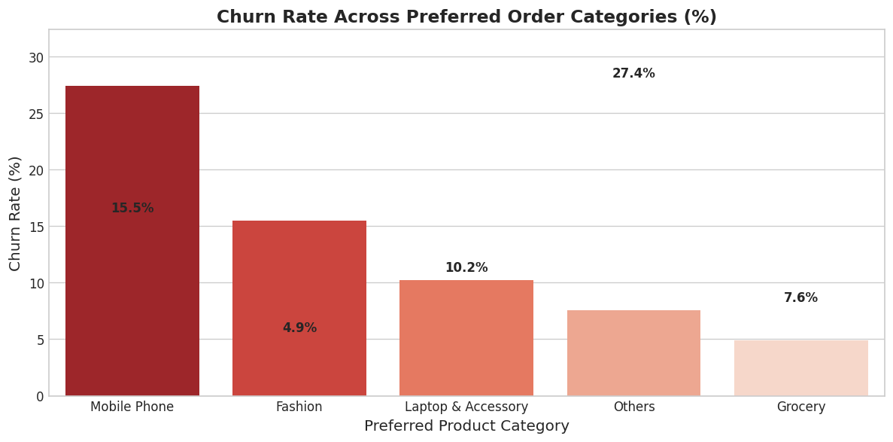
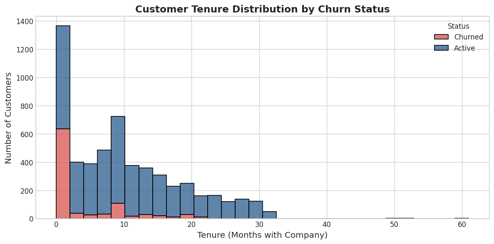
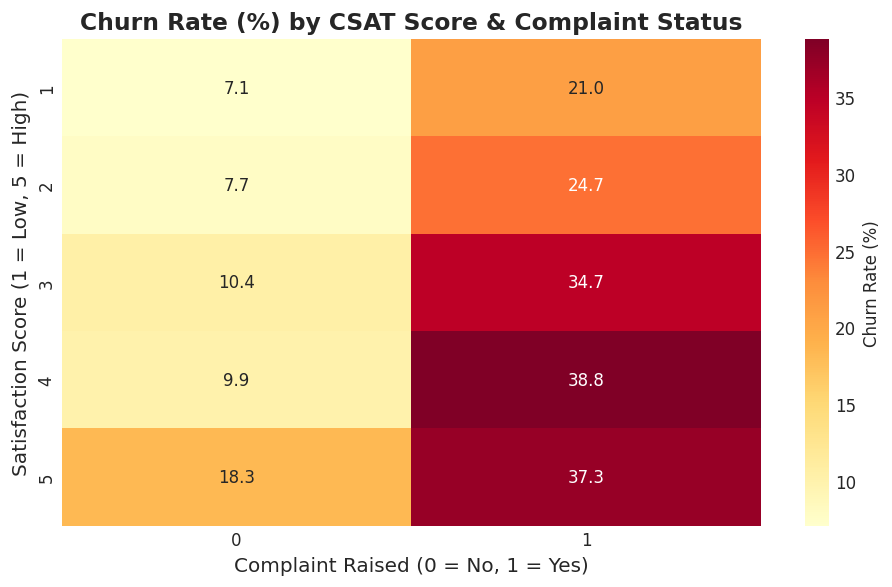
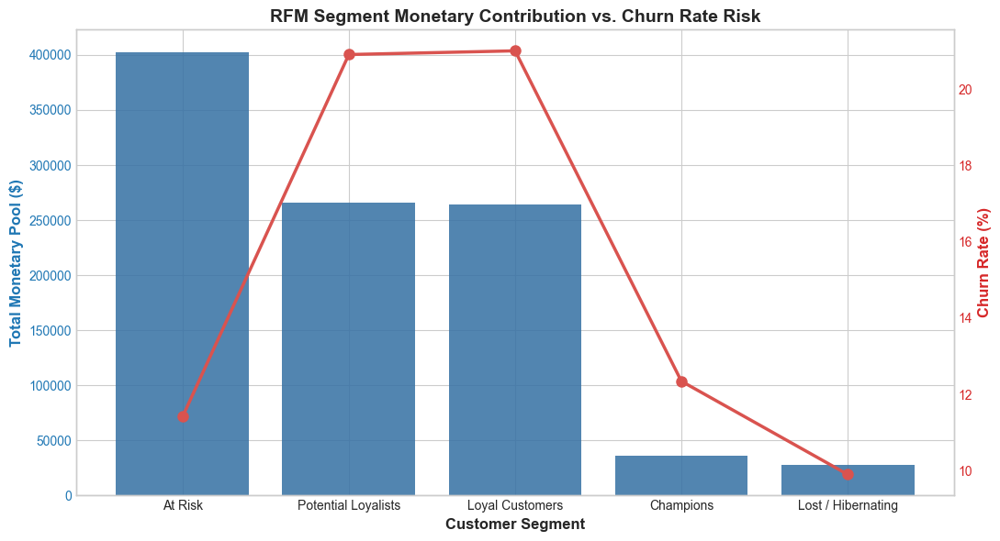
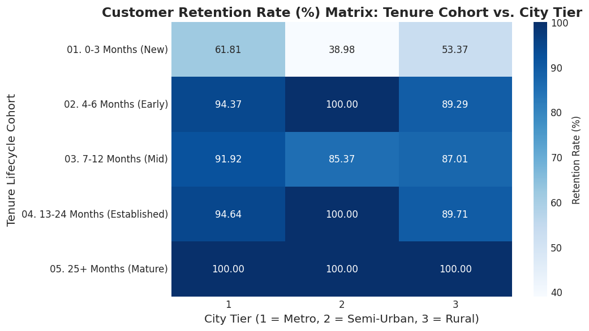

<p align="center">
  
  
  
  
  
</p>

<h1 align="center">📊 Customer Churn & Revenue Intelligence</h1>

<p align="center">
  <em>An end-to-end data analytics project uncovering why e-commerce customers leave, how much revenue is at risk, and which customer segments need immediate attention.</em>
</p>

<p align="center">
  <a href="#-key-business-insights">Key Insights</a> •
  <a href="#-project-structure">Structure</a> •
  <a href="#-analysis-pipeline">Pipeline</a> •
  <a href="#-visualizations">Visualizations</a> •
  <a href="#-tech-stack">Tech Stack</a> •
  <a href="#-how-to-run">Run</a>
</p>

---

## 🎯 Project Overview

This project performs a **full-stack analytics investigation** on an e-commerce platform's customer churn data — covering everything from raw data wrangling to executive-ready dashboards. The goal: **turn raw transactional data into actionable retention strategies**.

| Metric | Value |
|:--|:--|
| 👥 **Total Customers Analyzed** | 5,630 |
| 📉 **Overall Churn Rate** | 16.84% |
| 🔒 **Retention Rate** | 83.16% |
| 📦 **Features Engineered** | 20 behavioral, demographic & transactional |
| 🧠 **Analytical Techniques** | EDA · RFM Segmentation · Cohort Analysis · SQL Analytics |

---

## 💡 Key Business Insights

> **🔴 Mobile Phone buyers churn at 27.4%** — the highest across all product categories and nearly **6× the rate of Grocery buyers (4.9%)**.

> **⏳ The first 3 months are make-or-break** — new customers (0–3 months tenure) retain at only **49.27%**, meaning roughly half are lost before they even establish a habit.

> **🚨 Complaints are the #1 churn predictor** — customers who raised a complaint churn at **3–4× the rate** of those who didn't, *even when their satisfaction score is high (4–5/5)*.

> **🏙️ Semi-Urban new customers are most vulnerable** — Tier 2 city new customers have the worst retention at just **38.98%**, signaling a service or delivery gap.

> **🏆 Mature customers (25+ months) never leave** — **100% retention** across all city tiers, proving that surviving the early churn window creates lifetime loyalty.

---

## 📁 Project Structure

```
customer-churn-revenue-intelligence/
│
├── 📂 data/
│   ├── raw/
│   │   └── ecommerce_churn.csv              # Original dataset (5,630 records × 20 features)
│   └── processed/
│       ├── ecommerce_churn_clean.csv         # Cleaned dataset (median-imputed, validated)
│       ├── customer_churn_cleaned_v1.csv     # Alternate cleaned version
│       ├── rfm_customer_segments.csv         # Customers tagged with RFM segments
│       ├── tenure_cohort_retention.csv       # Cohort-level retention summary
│       └── churn_intelligence.db             # SQLite database for SQL analysis
│
├── 📂 notebooks/
│   ├── 01_data_understanding_and_cleaning.ipynb   # Data profiling & cleaning
│   ├── 02_exploratory_data_analysis.ipynb         # Full EDA with visualizations
│   ├── 03_rfm_analysis.ipynb                      # RFM customer segmentation
│   ├── 04_cohort_and_retention_analysis.ipynb     # Tenure-based cohort retention
│   └── 05_sql_analysis.ipynb                      # SQL-driven business intelligence
│
├── 📂 sql/
│   └── script.sql                            # Standalone SQL queries (CTEs, window functions)
│
├── 📂 visualizations/
│   ├── churn_by_category.png                 # Churn rate by product category
│   ├── churn_by_tenure.png                   # Churn distribution by customer tenure
│   ├── complaint_satisfaction_matrix.png     # Heatmap: complaints × satisfaction × churn
│   ├── rfm_segment_treemap.png               # RFM segment monetary vs. churn risk
│   └── tenure_retention_heatmap.png          # Retention matrix: cohort × city tier
│
├── 📂 dashboard/
│   └── Customer_Churn_Dashboard.pbix         # Interactive Power BI dashboard
│
├── 📂 docs/
│   ├── Customer_Churn_Presentation.pdf       # Executive presentation deck
│   └── Customer_Churn_Synopsis.pdf           # Detailed project synopsis
│
└── README.md
```

---

## 🔬 Analysis Pipeline

The project follows a structured **5-notebook analytical pipeline**, each building on the previous:

### 📓 Notebook 1 — Data Understanding & Cleaning
> *Foundation layer: profile, clean, and validate the raw dataset.*

- Loaded raw data (5,630 rows × 20 columns) and profiled data types, distributions, and completeness
- Identified & imputed missing values in 7 columns (`Tenure`, `WarehouseToHome`, `HourSpendOnApp`, `OrderAmountHikeFromlastYear`, `CouponUsed`, `OrderCount`, `DaySinceLastOrder`) using **median imputation**
- Validated zero duplicates and exported the clean dataset

### 📓 Notebook 2 — Exploratory Data Analysis
> *Deep-dive into churn patterns across behavioral, demographic, and transactional dimensions.*

- Computed global KPIs: **16.84% churn rate**, revenue-at-risk quantification
- Analyzed churn drivers across **product categories**, **tenure**, **complaints**, **satisfaction scores**, **payment modes**, **city tiers**, and **marital status**
- Discovered that **complaints amplify churn by 3–4×** regardless of satisfaction level
- Generated publication-ready visualizations

### 📓 Notebook 3 — RFM Segmentation
> *Classify every customer by value and engagement using Recency, Frequency, and Monetary scoring.*

- Mapped `DaySinceLastOrder` → Recency, `OrderCount` → Frequency, `CashbackAmount` → Monetary
- Applied **quintile-based scoring** (1–5) for each RFM dimension
- Segmented customers into 5 groups: **Champions**, **Loyal Customers**, **Potential Loyalists**, **At Risk**, **Lost/Hibernating**
- Key finding: *"At Risk"* segment holds the **largest monetary pool (~$400K)** — highest priority for retention campaigns

### 📓 Notebook 4 — Cohort & Retention Analysis
> *Lifecycle-based retention analysis to identify the critical intervention window.*

- Created **5 tenure-based cohorts**: New (0–3 mo), Early (4–6 mo), Mid (7–12 mo), Established (13–24 mo), Mature (25+ mo)
- Built a **retention matrix** (cohort × city tier) revealing geographic disparities
- Proved the **"golden 90 days"** thesis — customers who survive the first 3 months are retained at 90%+ rates

### 📓 Notebook 5 — SQL Analytics
> *Replicated the full analysis in SQL to demonstrate database querying proficiency.*

- Created a **SQLite database** and wrote 4 production-style queries
- Demonstrated advanced SQL: **CTEs**, **window functions** (`NTILE`), **CASE** expressions, multi-level aggregations
- Mirrored Python findings with pure SQL for cross-tool validation

---

## 📊 Visualizations

<table>
  <tr>
    <td align="center"><b>Churn by Product Category</b><br/></td>
    <td align="center"><b>Churn by Customer Tenure</b><br/></td>
  </tr>
  <tr>
    <td align="center"><b>Complaint × Satisfaction Matrix</b><br/></td>
    <td align="center"><b>RFM Segment: Value vs. Risk</b><br/></td>
  </tr>
  <tr>
    <td colspan="2" align="center"><b>Retention Heatmap: Cohort × City Tier</b><br/></td>
  </tr>
</table>

---

## 🛠️ Tech Stack

| Layer | Tools |
|:--|:--|
| **Language** | Python 3.x |
| **Data Manipulation** | Pandas, NumPy |
| **Visualization** | Matplotlib, Seaborn, Squarify (Treemaps) |
| **Database** | SQLite (via `sqlite3`) |
| **BI Dashboard** | Microsoft Power BI |
| **Environment** | Jupyter Notebook |

---

## 📋 Dataset Features

The dataset contains **20 features** across three dimensions:

| Dimension | Features |
|:--|:--|
| **Behavioral** | `Tenure`, `HourSpendOnApp`, `NumberOfDeviceRegistered`, `OrderCount`, `DaySinceLastOrder`, `CouponUsed`, `OrderAmountHikeFromlastYear` |
| **Demographic** | `Gender`, `MaritalStatus`, `CityTier`, `NumberOfAddress` |
| **Transactional** | `PreferredLoginDevice`, `PreferredPaymentMode`, `PreferedOrderCat`, `WarehouseToHome`, `CashbackAmount`, `SatisfactionScore`, `Complain` |
| **Target** | `Churn` (0 = Active, 1 = Churned) |

---

## 🚀 How to Run

### Prerequisites
```bash
pip install pandas numpy matplotlib seaborn squarify openpyxl jupyter
```

### Steps
```bash
# 1. Clone the repository
git clone https://github.com/yourusername/customer-churn-revenue-intelligence.git
cd customer-churn-revenue-intelligence

# 2. Launch Jupyter
jupyter notebook

# 3. Run notebooks in order (01 → 05)
# Each notebook is self-contained with relative paths
```

### Power BI Dashboard
Open `dashboard/Customer_Churn_Dashboard.pbix` in **Power BI Desktop** (free) to explore the interactive dashboard.

---

## 📌 Strategic Recommendations

Based on the analysis, here are the **top 3 actionable strategies**:

| # | Strategy | Rationale |
|:-:|:--|:--|
| 1 | **Launch a "First 90 Days" onboarding program** | 50.7% of new customers churn — early engagement (welcome emails, onboarding discounts, guided tutorials) could dramatically improve retention |
| 2 | **Overhaul complaint resolution for Mobile Phone category** | 27.4% churn + high complaint-driven churn = urgent need for dedicated support workflows and proactive follow-ups |
| 3 | **Deploy targeted retention campaigns for "At Risk" RFM segment** | This segment holds ~$400K in monetary value — personalized offers and re-engagement campaigns have the highest ROI potential |

---

## 📄 Documentation

- 📑 [**Project Synopsis**](docs/Customer_Churn_Synopsis.pdf) — Detailed methodology, findings, and conclusions
- 📊 [**Executive Presentation**](docs/Customer_Churn_Presentation.pdf) — Slide deck for stakeholder communication

---

## 👩‍💻 Author

**Aadhya Sharma**

Aspiring Data Analyst

Python • SQL • Power BI • Tableau • Excel

📍 Delhi, India

📧 aadhya2208@gmail.com

💼 LinkedIn: https://www.linkedin.com/in/aadhya-sharma-contactaadhya
